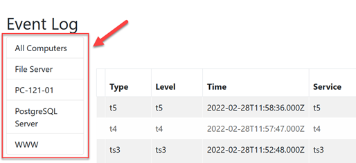
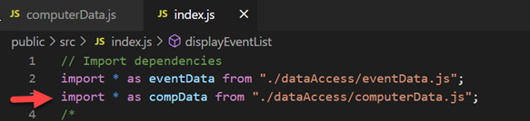
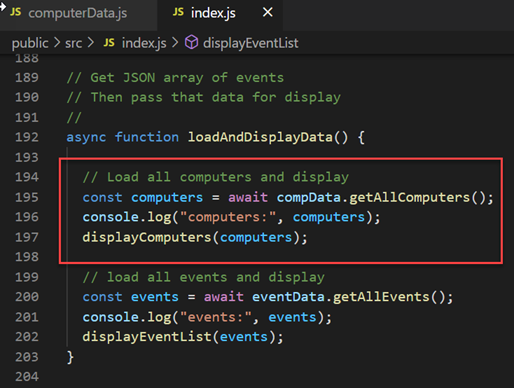
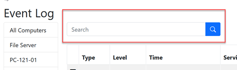
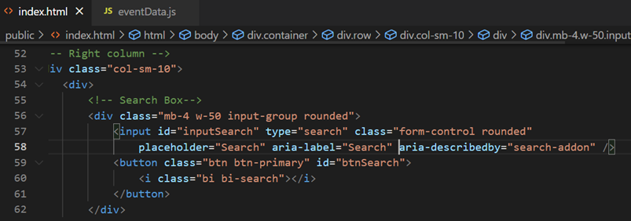
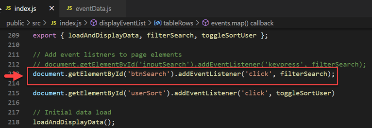
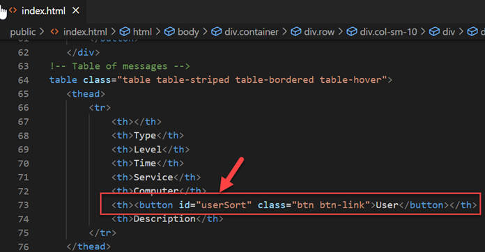
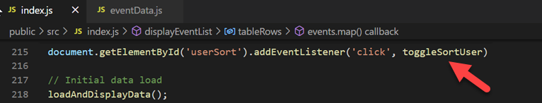
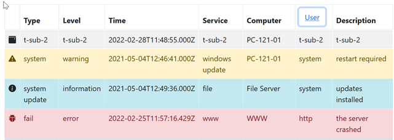
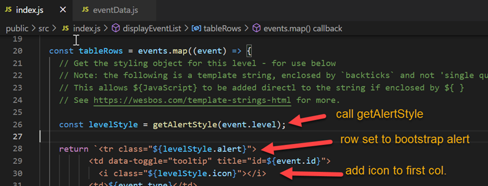

# Web Client App part 2

##### Enda Lee 2022

#### Quick Start

in terminal: 

1. ```npm install```
2. set `supabaseUrl` and `supabaseKey` in `/public/src/dataAccess/supabase.js`
2. ```npm run start```

## Introduction

This tutorial continues from part 1 which showed how to display data, from **your** ```Supabase``` database, in a web page.  The next steps add more functionality including the ability to filter data.

To get started, download the code from this repository. 

## Pre-requisites

This tutorial continues from the previous ones, make sure that you have completed them:

1. Have setup a ```Supabase``` account and created the example database (**[PART 1](https://github.com/elee-tudublin/year2-project-2022/blob/main/1.Database_Setup_Supabase.md)**)
2. Can insert to the database using an ```MQTT script``` and the ```Supabase API``` (**[PART 2](https://github.com/elee-tudublin/year2-project-2022/blob/main/2.Using_The_Supabase_API.md)**)
2. **[Web Client App Part 1](https://github.com/elee-tudublin/2022.Y2-Project_Web_Client.part_1)**

Open the start project  in  **[VS Code](https://code.visualstudio.com/)** before starting this tutorial.


## Part 1: Show Computers and use them to filter events

First display the list of computers. Then use them  to show events for a selected computer.




### Displaying computers

#### 1. Get a list of computers from the database.

   The functions in `computerData.js` handle access to computer data in the database

   

   Read the code comments for details:

   ```javascript
   /*
     Functions used to work with Computer related data
   */
   
   // Get a db connection by importing supabase.js which sets it up
   import { Supabase } from './supabase.js';
   
   // Function to get all events from supabase
   //
   async function getAllComputers() {
   
       // 1. define variable to store events
       let computers;
   
       // 1. execute query to get computers
       try {
         // 2. store result
         const result = await Supabase
           .from('computers') // select data from the computers table
           .select('*') // all columns
           .order('name', { ascending: true }); // sort by name
   
         // 3. Read data from the result
         computers = await result.data;
   
         // Catch and log errors to server side console
       } catch (error) {
         console.log("Supabase Error - get all events: ", error.message);
       } finally {
       }
       // 4. return all computers found
       return computers;
   }
   
   // Export functions for import elsewhere
   export {
     getAllComputers
   };
   ```


#### 2. Display the computers  

The function is called when the page loads, similar to the process for loading and displaying `events`. See `index.js`

First the `computerData.js` functions are imported (start of `index.js`):




Then computers are loaded and displayed in the `loadAndDisplayData()` function.




The `displayComputers()` function iterates through the list of computers, passed to it as a parameter, and adds them to the list at the left side of the page. *Read code comments for details*

```javascript
// 1. Parse JSON
// 2. Create computer links
// 3. Display in web page
//
function displayComputers(computers) {

  // Use the Array map method to iterate through the array of categories (in json format)
  const compLinks = computers.map((comp) => {

    // return a link button for each computer, setting attribute data-computer_id for the id
    // the data attribute is used instead of id as an id value can only be used once in the document
    // note the computer-link css class - used to identify the buttons (used later)
    return `<button data-computer_id="${comp.id}" class="list-group-item list-group-item-action computer-button">
              ${comp.name}
            </button>`;

  });

  // Add a link for 'all computers' to start of the list
  // first check compLinks is an array
  if (Array.isArray(compLinks)) {
    // Then use unshift to move all elements up one and insert a new element at the start
    // This button has computer_id=0
    compLinks.unshift(`<button data-computer_id="0" 
                        class="list-group-item list-group-item-action computer-button">
                        All Computers
                      </button>`);
  }

  // Set the innerHTML of the productRows root element = rows
  // join('') converts the rows array to a string, replacing the ',' delimiter with '' (blank)
  document.getElementById('computerList').innerHTML = compLinks.join("");

  // Add Event listeners to handle clicks
  // When clicked, the computer links will filter events - displaying  events for that computer
  //
  // 1. Find button all elements with matching the class name used to identify computer buttons
  const compButtons = document.getElementsByClassName('computer-button');

  // 2. Assign a 'click' event listener to each button
  // When clicked the filterComputer() function will be called.
  for (let i = 0; i < compButtons.length; i++) {
    compButtons[i].addEventListener('click', filterComputers);
  }
}

```


### Filtering Events By Computer

Now the computers are displayed and set up to call the `filterComputers()` function. This step will implement that function so that events can be displayed for just one computer.


#### 1. Getting events by computer id

First we need the `computer id`. When clicked the **`filterComputer()` function (in `index.js`)** is called. It gets the id of the clicked computer and then calls `eventData.getEventByCompId(compId)`. *Read the code comments for details*

```javascript
// Show events for selected computer
//
async function filterComputers() {

    // Get id of cat link (from the data attribute)
    // https://developer.mozilla.org/en-US/docs/Learn/HTML/Howto/Use_data_attributes
    const compId = Number(this.dataset.computer_id);

    // validation - if 0 or NaN reload everything
    if (isNaN(compId) || compId == 0) {
      loadAndDisplayData();
    
    // Otherwise get events for this computer
    } else {

      // Get events
      const events = await eventData.getEventByCompId(compId);

      // If events returned then display them
      if (Array.isArray(events)) {
        displayEventList(events);
      }
    }
}
```


The **`getEventByCompId(compId)` function (in `eventData.js`)** is very similar to the function used to get all events but uses a modified query to select where `computer_id` is equal to the `id` of the one required. 

```javascript
// Get events for a computer, by its id
//
async function getEventByCompId(id) {

  // to do: validate id

  // define variable to store events
  let events;

  // execute db query
  try {
    // Execute the query
    const result = await Supabase
      .from('events') // select from events
      .select('*, computers(name)') // * from events and name from computers
      .eq('computer_id', id) // where computer_id == id
      .order('timestamp', { ascending: false }); // order by timestamp

    // first element of the recordset contains products
    events = await result.data;
    //console.log('events: ', result.data);

    // Catch and log errors to server side console
  } catch (error) {
    console.log("Supabase Error - get all events: ", error.message);
  } finally {
  }
  // return all products found
  return events;
}
```


The `events` returned will only contain the events for that computer. The `filterComputer()` function (see above) then calls `displayEventList(events)` to update the page.


## Part 2: Search for events by keyword




The search box is set up to filter events when the button is clicked. Events with the search term in their descriptions are displayed.

#### 1. The HTML

Find the search box in `index.html`. It looks like this:



Note the id values of the input field `inputSearch` and the button `btnSearch`. These will be required later to handle the button click and to read the input value.

#### 2. Handling the button click

A click event listener is attached to the button near the end of `index.js`. The function `filterSearch()` will be called. 




The **`filterSearch()` function (index.js`)** reads the search value and then calls the `searchFilter()` function, which can be found in `eventData.js`.

```javascript
// Function to show events based on search box text
//
async function filterSearch() {

  // read the value of the search input field
  const search = document.getElementById('inputSearch').value;
  
    // Get events by calling eventData.Search
    const events = await eventData.searchFilter(search);

    // If events returned then display them
    if (Array.isArray(events)) {
      displayEventList(events);
    }

}
```


The **`searchFilter()` function (`eventData.js`)** uses a `testSearch` query to filter events.  See the supaBase reference for details:

1. https://supabase.com/docs/reference/javascript/textsearch
2. https://supabase.com/docs/reference/javascript/using-filters

```javascript
async function searchFilter(search) {
  // define variable to store events
  let events;

  // execute request
  try {
    // Execute the query
    const result = await Supabase
      .from('events') // from events
      .select('*, computers(name)') // select all and computers.name
      .textSearch('description', `'${search}'`) // filter result where description contains the search term
      .order('timestamp', { ascending: false }); // sort by timestamp

    // get data from result
    events = await result.data;
    //console.log('events: ', result.data);

    // Catch and log errors to server side console
  } catch (error) {
    console.log("Supabase Error - get all events: ", error.message);
  } finally {
  }
  // return all events found
  return events;
}
```


## Part 3: Sort results by clicking table header

The next example shows how to sort the events data by **User** in ascending or descending order.

To try it in the example, click the User table header. Checking the table HTML will reveal that the `User` header is a `button` with `id="userSort"`




In `index.js` you will see that a `click` event  listener is attached to the button which calls the `toggleSortUserFunction()`




The **`toggleSortUserFunction()` function** (`index.js`) calls `getAllEvents(orderCol, asc)` but sets the optional `orderCol` and `asc` values.

1. `orderCol` is set to so that events are sorted by `user` instead of the default `timestamp`. T

2. The sort order is toggled, i.e. if sort is currently ascending the set it to descending and vice-versa.

   To make this work, the last sort order is stored in the browser `sessionStorage` so that it is *remembered*.

   When the `sessionStorage` value `sortUser` is read, its `Boolean` (rue or false) value is reversed.

```javascript
// Sort based on user value
// sort direction opposite to current direction
//
async function toggleSortUser() {

  // read current sort order from session storage if true
  let sUser = JSON.parse(sessionStorage.getItem('sortUser')) === true;

  // set session storage value to opposite (not sUser or !sUser)
  sessionStorage.setItem('sortUser', !sUser);

  // load events - passs filter options as parameters
  const events = await eventData.getAllEvents('user', !sUser);
  console.log("events:", events);
  displayEventList(events);

}
```


## Part 4: Format table rows and add an icon

The events are styled according to level values using [Bootstrap 5 alerts](https://getbootstrap.com/docs/5.0/components/alerts/) for row colour and also [Bootstrap icons](https://icons.getbootstrap.com/)



The **`getAlertStyle(level) function`** (`index.js`) defines the style to be used based on the level value.

```javascript
// Return event styling depending on level
// icons - https://icons.getbootstrap.com/
//
function getAlertStyle(level) {
  const error = {
    alert: 'alert alert-danger',
    icon: 'bi bi-bug-fill'
  };

  const warning = {
    alert: 'alert alert-warning',
    icon: 'bi bi-exclamation-triangle-fill'
  };

  const information = {
    alert: 'alert alert-info',
    icon: 'bi bi-info-circle-fill'
  };

  const _default = {
    alert: 'alert alert-light',
    icon: 'bi bi-calendar3-event-fill'
  };

  // return style object based on level value
  switch (level) {
    case 'error':
      return error;
    case 'warning':
      return warning;
    case 'information':
      return information;
    // Everything else
    default:
      return _default;
  }
}
```


The **`displayEventsList(events) function`** (`index.js`) has been modified to use the styling when generating table rows.




------

Enda Lee 2022